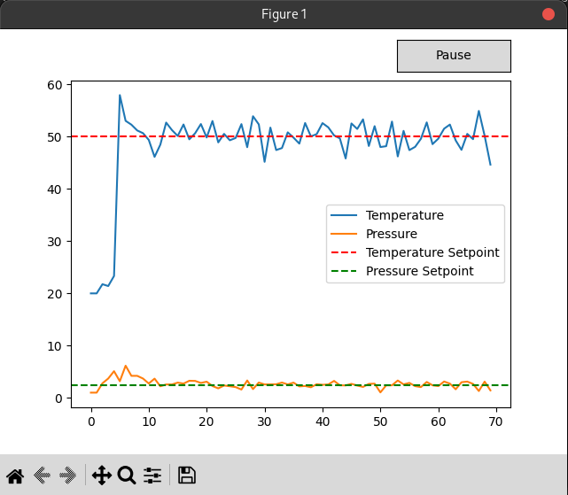

# Coding Assignment

The task is to develop a simulation for a Control System. The simulation will be used to control the temperature and pressure of a machine. The machine has two sensors that provide real-time readings of the temperature and pressure. The machine also has two parameters that can be adjusted to control the temperature and pressure. The goal of the simulation is to control the temperature and pressure of the machine by adjusting the parameters based on the sensor readings.

## Setup Instructions

1. Run modern Linux, modern Python, modern C++ (g++) or other equivalent tools
1. Clone the repository and open the cloned directory in the terminal
1. Install the required Python packages, eg: `pip install -r requirements.txt`
1. Run the solution with `g++ -m64 -shared -o control_system.dll control_system.cpp -lpthread -fPIC && python3 control_system.py`
   or equivalent command on a different environment.

You should see the following graph showing the real-time simulated temperature and pressure values of the system.
There is a short initial delay before the controller is started to accentuate the difference before and after.

